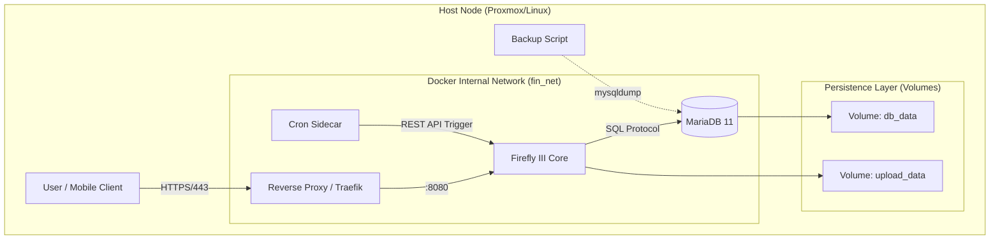

# Architecture

## Overview

## Data Flow (Narrative)

1. User accesses Firefly III through Traefik over HTTPS.
2. Firefly III reads and writes transaction data in MariaDB.
3. Cron sidecar triggers scheduled tasks via the Firefly III API.
4. Backups are taken via `mysqldump` and stored locally, then copied offsite.
