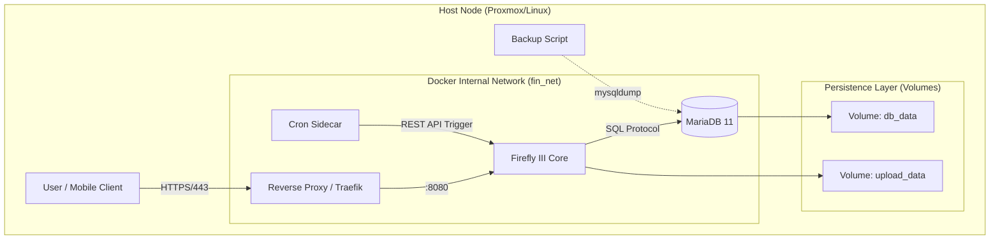

# Architecture

## Overview

## Components

- **Firefly III Core**: Stateless Laravel app providing the UI/API.
- **MariaDB 11**: ACID-compliant database using InnoDB.
- **Cron Sidecar**: Triggers Firefly III cron endpoint for scheduled jobs.
- **Traefik**: Optional reverse proxy for HTTPS and routing.
- **Volumes**: Persistent storage for DB and uploads.
